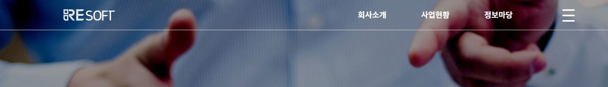
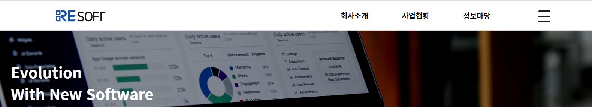
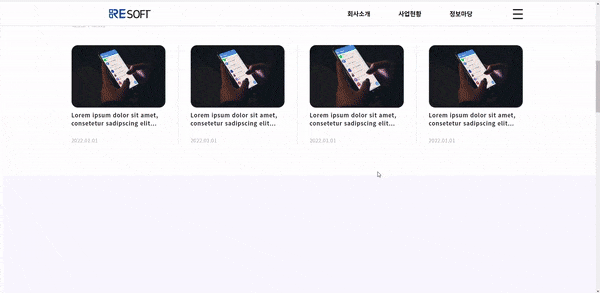
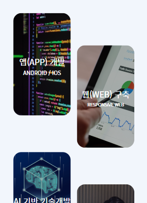
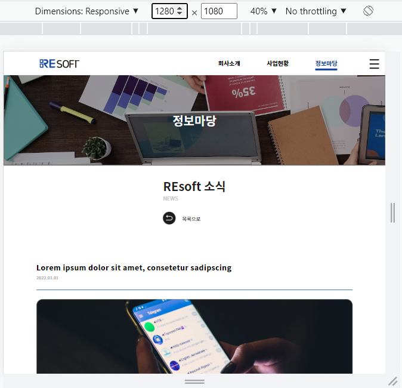

## REsoft 결과 보고서 - 3조

### 1. 이름 : 김유민
   - 맡은 부분 : Main 페이지 - header, project, service, footer 부분
   
   - 다르게 한 부분:
   * header 부분
      * position: fixed 되었을때 스크롤 이벤트를 주어, 아래로 스크롤 시 배경 및 글자 색 변경.
      
   	               &darr;
      

  * project, service 부분
      * 왼쪽 오른쪽 부분 콘텐츠 나눠서 fadeInLeft, fadeInRight 애니메이션 추가.  
      

   * service 부분
      * 해상도가 줄어들때 안의 박스들도 같이 줄어들게 width 값 조절함.  
      

### 2. 이름 : 권기찬
   - 맡은 부분 : sub page  "정보마당" 
   
   - 다르게 한 부분: 
     -  네비게이션 밑 이미지 부분에 호버 2초이후 링크가 클릭이 되는 기능 삭제

### 3. 이름 : 김효민
   - 맡은 부분 : sub page "회사소개"
   
   - 다르게 한 부분: 특허,인증 부분 1280px 보다 클때 사각형을 2줄로 변경함

### 4. 이름 : 오성식
   - 맡은 부분 : main page(slider, resoft news, reference)
   
   - 다르게 한 부분 : 
      - main page 의 슬라이더 밑 '리소프트의 새로운 소식' 부분에 마우스 hover시 이미지 확대되는 속도를 더 빠르게 제작

### 5. 이름 : 이승연
   - 맡은 부분 : sub page "사업현황"
   
   - 다르게 한 부분: width가 1280px이하일 때 세로로 정렬하는 미디어쿼리 추가/ wow.js를 이용한 스크롤 애니메이션 효과 추가

### 6. 이름 : 이정현
   - 맡은 부분 : sub page  "정보마당" REsoft 소식 기사 나오는 페이지
   
   - 다르게 한 부분: 제 페이지 관련 반응형이 따로 없어서, width가 1280px이하일 때 컨텐츠들이 다 세로로 보기 좋게 정렬하기 위해, 간단한 미디어쿼리를 줬습니다.
   
